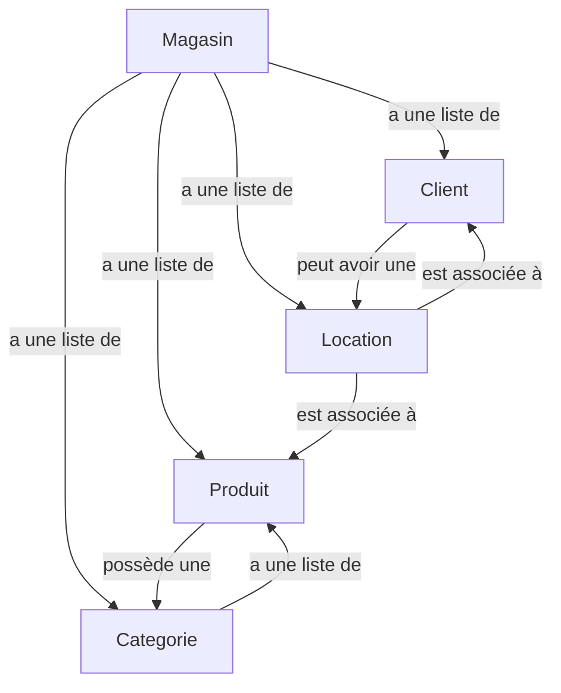

<!-- TABLE OF CONTENTS -->
<details>
  <summary>Table des matieres</summary>
    <ol>
      <li>
        <a href="#methodologie-et-spécification">Methodologie et spécifiction</a>
          <ul>
            <li><a href="#methodologie">Methodologie</a></li>
            <li><a href="#spécification-du-système">Spécification du système</a></li>
            <li><a href="#représentation-graphique-du-système">Représentation graphique du système</a></li>
          </ul>
        <a href="#serveur">Serveur</a>
        <ul>
          <li><a href="#exécution-du-serveur">Exécution du serveur</a></li>
          <li><a href="#effectuer-des-requêtes">Effectuer des requêtes</a></li>
        </ul>
      </li>
    </ol>
</details>

# Methodologie et spécifiction

## Methodologie

J'ai choisi de rédiger la spécification OpenAPI avant de développer le serveur Node, et ce choix repose sur plusieurs raisons.

1. La définition préalable de la spécification permet d'éviter d'éventuelles incohérences dans la structure du serveur. En établissant la spécification en amont, la mise en œuvre des fonctions devient une tâche plus claire et il y a moins de risques de devoir revenir ultérieurement sur la structure du serveur.

2. OpenAPI simplifie la génération de la structure de base du serveur. En générant une grande partie du code initial, il reste ensuite simplement à compléter les différentes méthodes et à créer un fichier de données de test. Cette approche garantit également que le serveur est en conformité avec la spécification, assurant ainsi la cohérence entre la conception initiale et l'implémentation finale.

## Spécification du système

Le système s'articule autour d'une API REST dédiée à la gestion d'un magasin spécialisé dans la location d'équipements de ski. Les entités clés englobent les produits, les clients, les locations, ainsi que les catégories de produits. La conformité de l'API aux spécifications est détaillée comme suit :

1. Le magasin est caractérisé par un nom, une adresse. Il détient un ensemble de produits, de clients, de locations, ainsi que des catégories.

2. Chaque produit est identifiable par un identifiant unique. Il possède un nom, un état (neuf, bon état, passable, abîmé), une disponibilité (disponible, déjà loué), et appartient à une catégorie.

3. Chaque client est défini par un identifiant unique. Il comporte un nom, un prénom, un numéro de téléphone, et peut avoir une location associée.

4. Chaque location est représentée par un identifiant unique. Elle inclut une liste de produits associés, un client lié, une date de début, et une date de fin de location.

5. Chaque catégorie dispose d'un identifiant unique. Elle est composée d'un nom, d'une description, et d'une liste de noms de produits associés.

6. Les principales opérations du système comprennent la gestion des des produits, des clients, des locations et des catégories. Par exemple, les développeurs peuvent effectuer des actions telles que la récupération de la liste des produits, l'ajout d'un nouveau cleint, la mise à jour d'une location existante ou la suppression d'une catégorie.

7. Il doit être envisageable d'afficher les informations relatives à une catégorie à partir d'un produit donné.

8. La doit être possible de visualiser les locations d'un client.

9. Il doit etre possible d'afficher la liste de tous les produits que contient une location ainsi que le client associé à celle-ci.

10. Il doit etre possible d'afficher tous les produits contenu dans une catégorie.

11. Il doit être possible de limiter le nombre de produits retournés par une requête.

## Représentation graphique du système



# Serveur

## Exécution du serveur

```sh
# Clone le répertoire
git clone git@github.com:Mayeul-Deries/server-node-r5.08.git

# Installer les packages
npm install

# Lancer le serveur
npm start
```

## Effectuer des requêtes

Afin d'effectuer des requêtes, on peut utiliser un outil comme RapidAPI (dans vscode) ou Postman.
le point d'entrée est défini par le chemin `/` à l'adresse `http://localhost:8080/`.

[!WARNING]
Pensez bien à ajouter un `/` à la fin de chaque requête.

[!CAUTION]
Pensez à bien vider le `body` lors des requêtes delete (pour les utilisateurs de rapidAPI).
